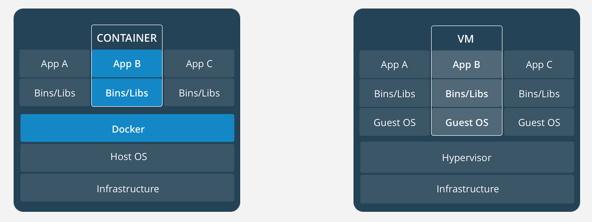
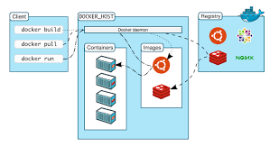

<h2>Giới thiệu về docker</h2>
<h3>Nội dung</h3>
<h4>1.1 Docker là gì?</h4>
<ul>
<li>Docker là một ứng dụng mã nguồn mở cho phép độc lập triển khai giữa các ứng dụng và cơ sở hạ tầng đối với các nhà phát triển và mở ra tiềm năng tạo nên một mô hình cho sự hợp tác tốt và đổi mới hơn.

<li>Docker giải quyết vấn đề khi mà các doanh nghiệp ngày nay đang chịu áp lực phải chuyển đổi kỹ thuật số nhưng bị hạn chế bởi các ứng dụng và cơ sở hạ tầng hiện tại đồng thời hợp lý hóa danh mục cloud, trung tâm dữ liệu và kiến trúc ứng dụng ngày càng đa dạng.
<ul>
<h4>1.2 Chức năng và vai trò của docker</h4>
<ul>
<li>Cho phép phát triển, di chuyển và chạy các ứng dụng dựa vào công nghệ ảo hóa container trong Linux.

<li>Tự động triển khai các ứng dụng bên trong các container bằng cách cung cấp thêm một lớp trừu tượng và tự động hóa việc ảo hóa "mức hệ điều hành".

<li>Docker có thể sử dụng được trên cả 3 hệ điều hành phổ biến: Windows, Linux và Mac OS.

<li>Lợi ích của docker bao gồm:
<ul>
<li>Nhanh trong việc triển khai, di chuyển, khởi động container
<li>Bảo mật
<li>Lightweight (tiết kiệm disk & CPU)
<li>Mã nguồn mở
<li>Hỗ trợ APIs để giao tiếp với container
<li>Phù hợp trong môi trường làm việc đòi hòi phải liên tục tích hợp và triển khai các dịch vụ, phát triển cục bộ, các ứng dụng multi-tier.
</ul>
<h6>Làm rõ hơn về vấn đề tại sao sử dụng Docker</h6>
<ul>
Có rất nhiều lợi ích khi sử dụng Docker, bao gồm:

<li>Tính nhất quán(Consistency): Docker đảm bảo rằng ứng dụng của bạn sẽ chạy giống nhau trên mọi máy tính, bất kể hệ điều hành hoặc phần mềm khác được cài đặt.
<li>Tính di động(Portability): Docker container có thể dễ dàng chia sẻ và triển khai tới bất kỳ máy tính nào đã cài đặt Docker.
<li>Cách ly(Isolation): Các bộ chứa Docker chạy cách ly với nhau, nghĩa là chúng không thể can thiệp lẫn nhau hoặc với hệ điều hành máy chủ.
<li>Bảo mật(Security): Các bộ chứa Docker có thể được sử dụng để cải thiện tính bảo mật cho các ứng dụng của bạn bằng cách cách ly chúng khỏi hệ điều hành máy chủ và với nhau.
</ul>
</ul>
**What is the difference between a container and a virtual machine?

Vùng chứa là một gói nhẹ, độc lập, có thể thực thi được, bao gồm mọi thứ mà ứng dụng của bạn cần để chạy. Máy ảo là một hệ điều hành hoàn chỉnh chạy trên hệ điều hành máy chủ. Các thùng chứa nhẹ hơn và di động hơn so với máy ảo và chúng không yêu cầu nhiều chi phí.

**
<h4>1.3 Khái niệm khi sử dụng docker</h4>
<h5>1.3.1 Image </h5>
<ul>
<li>Image trong Docker hay còn gọi là Mirror. Là một template có sẵn (hoặc có thể tự tạo) với các chỉ dẫn dùng để tạo ra các container.

<li>Được xây dựng từ một loạt các layers. Mỗi layer là một kết quả đại diện cho một lệnh trong Dockerfile.

<li>Lưu trữ dưới dạng read-only template.
</ul>
<h5>1.3.2 Registry</h5>
<ul>
<li>Docker Registry là nơi lưu trữ các image với hai chế độ là private và public.

<li>Là nơi cho phép chia sẻ các image template để sử dụng trong quá trình làm việc với Docker.
</ul>
<h5>1.3.3 Volume</h5>
<ul>
<li>Volume trong Docker là nơi dùng để chia sẻ dữ liệu cho các container.

<li>Có thể thực hiện sử dụng Volume đối với 2 trường hợp:
<ul>
<li>Chia sẻ giữa container với container.
<li>Chia sẻ giữa container và host.
</ul>
</ul>
<h5>1.3.4 Container</h5>
<ul>
<li>Docker Container là một thể hiện của Docker Image với những thao tác cơ bản để sử dụng qua CLI như start, stop, restart hay delete, ...

<li>Container Image là một gói phần mềm thực thi lightweight, độc lập và có thể thực thi được bao gồm mọi thứ cần thiết để chạy được nó: code, runtime, system tools, system libraries, settings. Các ứng dụng có sẵn cho cả Linux và Windows, các container sẽ luôn chạy ổn định bất kể môi trường.

<li>Containers and virtual machines có sự cách ly và phân bổ tài nguyên tương tự, nhưng có chức năng khác vì các container ảo hóa hệ điều hành thay vì phần cứng. Các container có tính portable và hiệu quả hơn.

<li>Container là một sự trừu tượng hóa ở lớp ứng dụng và code phụ thuộc vào nhau. Nhiều container có thể chạy trên cùng một máy và chia sẻ kernel của hệ điều hành với các container khác, mỗi máy đều chạy như các quá trình bị cô lập trong không gian người dùng. Các container chiếm ít không gian hơn các máy ảo (container image thường có vài trăm thậm chí là vài MB), và start gần như ngay lập tức.

<li>Máy ảo (VM) là một sự trừu tượng của phần cứng vật lý chuyển tiếp từ một máy chủ sang nhiều máy chủ. Hypervisor cho phép nhiều máy ảo chạy trên một máy duy nhất. Mỗi máy ảo bao gồm một bản sao đầy đủ của một hệ điều hành, một hoặc nhiều ứng dụng, các chương trình và thư viện cần thiết - chiếm hàng chục GB. Máy ảo cũng có thể khởi động chậm.
<h5>1.3.5 Dockerfile<h5>
<ul>
<li>Docker Image có thể được tạo ra một cách tự động bằng việc đọc các chỉ dẫn trong Dockerfile.

<li>Dockerfile là một dữ liệu văn bản bao gồm các câu lệnh mà người sử dụng có thể gọi qua các dòng lệnh để tạo ra một image.

<li>Bằng việc sử dụng docker build người dùng có thể tạo một tự động xây dựng thực hiện một số lệnh dòng lệnh liên tiếp.
</ul>

<h4>1.4 Các thành phần, kiến trúc trong docker</h4>
<ul>

<li>Hình ảnh bên trên là mô tả về Docker Engine. Theo đó, Docker Engine là một ứng dụng client-server với các thành phần chính:
<ul>
<li>Một máy chủ đảm nhiệm thực hiện quá trình daemon (chạy câu lệnh docker).
<li>REST API xác định các giao diện mà các chương trình có thể sử dụng để nói chuyện với daemon và hướng dẫn nó phải làm gì.
<li>Một CLI (chạy câu lệnh docker).
</ul>
<li>CLI sẽ sử dụng Docker REST API để kiểm soát hoặc tương tác với Docker daemon thông qua kịch bản hoặc lệnh CLI trực tiếp.

<li>Docker sử dụng kiến trúc client-server. Docker client sẽ giao tiếp với Docker daemon các công việc building, running và distributing các Docker Container.

<li>Docker client và Docker daemon có thể chạy cùng trên một hệ thống hoặc ta có thể kết nối một Docker client tới một remote Docker daemon. Docker client và Docker daemon liên lạc với nhau bằng việc sử dụng REST API thông qua UNIX sockets hoặc network interfaces.

<li>Docker daemon (dockerd ) sẽ lắng nghe các request từ Docker API và quản lý Docker objects bao gồm images, containers, networks và volumes. Một daemon cũng có thể liên lạc với các daemons khác để quản lý Docker services.

<li>Docker client (docker ) là con đường chính để những người sử dụng Docker tương tác và giao tiếp với Docker. Khi sử dụng mộ câu lệnh chẳng hạn như docker run thì client sẽ gửi câu lệnh tới dockerd để thực hiện câu lệnh. Các câu lệnh từ Docker client sử dụng Docker API và có thể giao tiếp với nhiều Docker daemon.
</ul>

<h4>1.5 Các trạng thái, sự chuyển giao trạng thái của container</h4>

Hình ảnh dưới đây mô tả cho một vòng đời của container trong Docker cùng với các trạng thái hoạt động:

