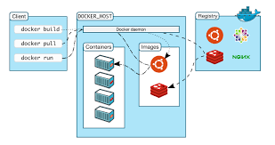

<h2>Định nghĩa về Docker</h2>
<ul>
<li>Docker là một nền tảng mở cho phép phát triển, vận chuyển và chạy các ứng dụng dựa vào công nghệ ảo hóa container
<li>Docker là một dự án mã nguồn mở cho phép tự động hóa việc triển khai các ứng dụng bên trong các phần mềm container bằng cách cung cấp thêm một lớp trừu tượng và tự động hóa việc "ảo hóa cấp độ hệ điều hành" trên Linux, Mac, Windows
</ul>

<h2>Các thành phần/kiến trúc trong Docker</h2>
<h3>Cài đặt Docker</h3>

cài đặt trên linux

        sudo yum check-update
        curl -fsSL https://get.docker.com/ | sh

        sudo systemctl start docker
        sudo systemctl status docker
        sudo systemctl enable docker

        docker version

<h3>Các thành phần chính</h3>

<ul>

 Docker client: 

<li>Giao diện cơ bản cho người dùng sử dụng Docker. Nó nhận lệnh từ người dùng và truyền thông qua lại với Docker daemon
<li>Client và daemon có thể chạy trên cùng hoặc khác host

Docker daemon: 

<li> Chạy trên một host machine
<li> Người dùng không tương tác trực tiếp với daemon, mà thông qua Docker client với RESTful api hoặc sockets
</ul>

<h3>Thực hiện tải image có tên là hello-word và tạo container đầu tiên</h3>

Câu lệnh

        docker pull hello-world
        docker run hello-world

Docker image

<ul>
<li> Docker image hay còn gọi là docker mirror
<li> Là read-only template dùng để tạo ra các container
<li> Có một vài cách để tạo ra các bản mirror
<ul>
<li> Tạo ra một mirror từ đầu
<li> Tạo ra một mirror bằng cách download của người khác
<li>Tạo ra từ một mirror đã tồn tại trước đó
</ul>
</ul>
<h3>Tìm images, tải images, liệt kê, xóa images</h3>

 Câu lệnh

<ul>
<li> docker search ubuntu   #Tìm image có tên là ubuntu
<li> docker pull httpd      #Tải image có tên là httpd
<li> docker images          #Liệt kê các images đã tải
<li> docker rmi ubuntu      #Xóa image có tên là ubuntu
</ul>

Docker container

<ul>
<li>Docker container chính là một thể hiện của docker image
<li>Chúng ta có thể có các thao tác cơ bản: start, stop, move, delete với container thông qua CLI hoặc API
</ul>

Docker registry

<ul>
<li>Registry là nơi lưu trữ các image
<li>Registry có thể là private hoặc public
<li>Docker Hub Repositories bên trong Registry
</ul>

Docker file

<ul>
<li> Là một tài liệu chứa tất cả các lệnh của người dùng để tạo ra một image
<li> Dockerfile có thể sử dụng comment để giải thích
</ul>

Docker volume

<ul>
<li>Sử dụng để chia sẻ dữ liệu giữa host-container, container-container
<li>Có 2 kiểu docker volume: bind mount và data managed volume
</ul>