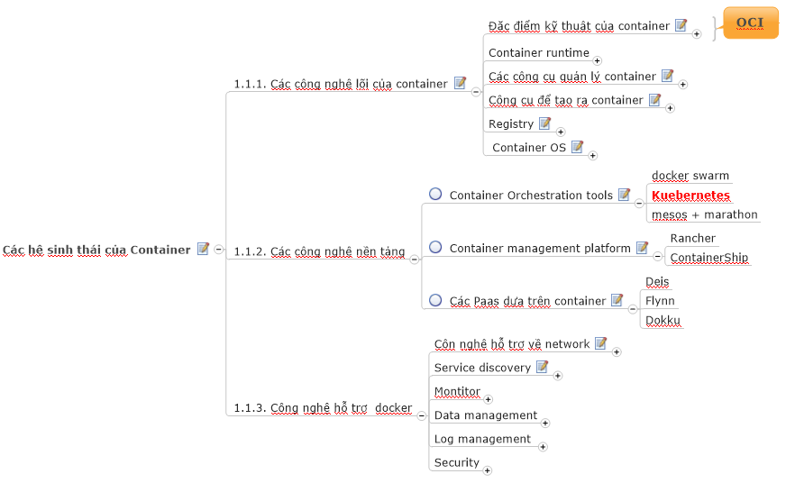

<h2>GIỚI THIỆU VỀ K8S</h2>

<code>Kubernetes chỉ là một phần trong hệ sinh thái của container ngày nay</code> do vậy trước khi đi vào tìm hiểu về Kubernetes, chúng ta cần biết tổng quan về hệ sinh thái của container. Trong hệ sinh thái của container có 03 phần chính, bao gồm: 
<ul>
<li>Phần 1: Đây là thành phần cơ bản và cốt lõi nhất trong hệ sinh thái container, các thành phần này bao gồm: Kiến trúc lõi của container (các khái niệm về runtime spec, image format speck); khái niệm images, network và storage.
<li>Phần 2: Các công nghệ về platform liên quan tới container, bao gồm: các sản phẩm để orchestration container (sử dụng để khởi tạo các container theo các cơ chế điều phối), nền tảng để quản lý các container và các nền tảng PaaS dựa trên container.
<li>Phần 3: Các công nghệ hỗ trợ container, bao gồm: công nghệ hỗ trợ khi triển khai container trên nhiều máy chủ vật lý, các giải pháp phụ trợ về thu thập log và gaims sát.

<li>Kubernetes là một sản phẩm nằm trong phần 2 của hệ sinh thái của container hiện nay. Nó đóng vai trò là là một công cụ orchestration (tạo ra, điều phối và chỉ huy các container) - nôm na mà nói thì kubernetes là thằng túm đầu các máy vật lý hoặc máy ảo được cài đặt môi trường để triển khai container.
</ul>

<h2>Các thông tin khởi đầu với K8s</h2>
<h3>Trước khi bắt đầu tìm hiểu về K8S, cần có: </h3>
<ul>
<li> Vừa đọc khái niệm lý thuyết + thực hành
<li> Tìm hiểu về container + docker ở mức bas
<li> Kỹ năng và kiến thức làm việc với K8S: Linux
<li> Network, web server, db
</ul>
<h3>Cách cài đặt K8S</h3>

K8S có rất nhiều cách cài (công cụ khác nhau) khác nhau, tùy ngữ cảnh mà áp dụng. Tựu chung lại có 02 phương pháp cài đặt chính, đó là cài bằng tay và cài tự động (tự động thông qua các tools hoặc script mà bên khác cung cấp).

<ul>
<li>Cài bằng tay: Có nghĩa là cài theo kiểu step by step theo tài liệu của K8S.
<ul>
<li>
Cài bằng tay thì tốn nhiều thời gian (có cách khắc phục là viết script hoặc lợi dụng các tools ở dưới) nhưng mang lại lợi ích về việc nắm chắc các bước nếu như bỏ thời gian đọc và cài theo.
<li>
Thích hợp với các môi trường phục vụ chạy production hoặc mô trường có nhiều host vật lý.
<li>
Cài bằng tay bằng các lệnh hoặc biên dịch từ mã nguồn mà K8S cung câp.
</ul>
<li><Code>Minikube</code>: Là một công cụ để cài đặt K8S - sử dụng nó như là cách bạn sử dụng mỳ ăn liền ấy. <code>Minikube</code> có các đặc điểm sau:
<ul>
<li><code>Minikube</code> có thể hiểu là mì ăn liền trong thực tế, như vậy nó có tương đối các thành phần để đảm bảo K8S hoạt động được.
<li><code>Minikube</code> thích hợp với việc thử nghiệm ban đầu và thường cài trên 1 máy.</code>
<li><code>Minikube</code> có thể chạy trên nhiều hệ điều hành khác nhau nhưng tốt nhất nên có một máy Ubuntu hoặc Centos để cài Minikube
</ul>
<li>Cài bằng các tools đã được chế lại theo môi trường triển khai, tùy vào nhà cung cấp dịch vụ mà họ sẽ cung cấp các công cụ cài hoặc thậm chí đã cài sẵn (tự tìm hiểu trên gg)
</ul>

# *.* Tạo Pod
Khi tạo một Pod mới, thì cơ bản các sự kiện diễn ra và các thành phần tham gia và các sự kiện đó như sau:
## 
### Chi tiết luồng tạo Pod:
- Khi ta thực hiện tạo một Pod mới, thông tường là dùng lệnh kubectl để apply một file yaml là file mô tả chi thiết các thông tin cần thiết cho việc tạo Pod. Khi đó bản chất lệnh kubectl sẽ làm việc với api-server để gọi một api tương ứng cho việc tạo Pod.

- API server xử lý yêu cầu trên bằng cách validate cú pháp của file yaml và nếu không có vấn đề gì thì sẽ thực hiện ghi dữ liệu này vào etcd - Là key-value db đã mô tả bên trên. Như vậy tại thời điểm này, trên hệ thống đã ghi nhận một Pod mới cần được tạo. Sau khi ghi xong vào etcd thì api-server phản hồi lại kết quả cho client là Pod đã được tạo.

- Lúc này tới lượt scheduler tham gia vào. Như đã nói, nó sẽ theo dõi các Pod mới tạo trên hệ thống (bằng cách định kỳ kiểm tra api-server xem có thay đổi không) mà chưa được gán vào node để xử lý. Giờ nó phát hiện ra Pod mới này, nó sẽ lấy thông tin của Pod này và tìm một node thỏa mãn các yêu cầu, ví dụ là node1 và update vào thông tin của Pod là nó hãy chạy trên node1. Thông tin này được scheduler gửi cho api-server

- API server nhận được thông tin Pod mới được gán vào node1 thì thực hiện update thông tin này và etcd. Lúc nào pod ở trạng thái bound.

- Tiếp đến là kubelet cũng theo dõi các Pod ở trạng thái bound và được xếp lịch chạy trên node đó (bằng cách định kỳ lấy thông tin từ api-server). Ví dụ trong trường hợp này kubelet trên node1 phát hiện Pod mới được yêu cầu chạy trên node1 nên nó sẽ lấy thông tin cần thiết cho Pod và chạy Pod này thành các container trên node1. sau đó update lại trạng thái của Pod cho api-server.

- API server nhận được thông tin cập nhật trạng thái Pod từ kubelet ở node1 thì nó thực hiện ghi thông tin này vào etcd và nhận phản hồi kết quả từ etcd. Sau đó nó gửi bản tin acknowledgement tới kubelete để báo rằng event này đã được chấp nhận.

# *.* Xóa Pod
Ngược lại với tạo Pod thì ta xem xét luồng xóa Pod như sau:
## 
### Chi tiết luồng xóa Pod:
Người dùng gửi lệnh để xóa Pod
Đối tượng Pod trên k8s được cập nhật trạng thái thành "dead" sau một khoảng thời gian gọi là grace-time
Các hành động sau diễn ra song song:
Pod sẽ hiện thị ở trạng thái "Terminating" khi được kiểm tra từ phía client
Kubelet thấy một Pod được đánh dấu là Terminating thì nó bắt đầu thực hiện dừng process của Pod
Endpoint controller theo dõi pod đã được xóa chưa để xóa thông tin pod đó khỏi các endpoint mà nó phục vụ
Nếu pod có định nghĩa một preStop hook, thì nó được gọi tới bên trong pod. Nếu preStop hook vẫn đang chạy mà grace-time đã hết, thì bước (2) sẽ lại được gọi với thời gian grace-time nới thêm là 2 giây. Các bạn có thể tìm hiểu thêm về "Container hook" ở đây.
Process bên trong Pod đã được gửi tín hiệu yêu cầu terminate (TERM signal)
Sau khi grace-time kết thúc, thì mọi process bên trong Pod sẽ bị kill bởi SIGKILL.
Kubelet hoàn thành xóa Pod bằng cách gọi API server và set grace-time bằng 0, nghĩa là yêu cầu xóa ngay lập tức. Lúc này Pod sẽ không còn và client sẽ không thể thấy được Pod này nữa.