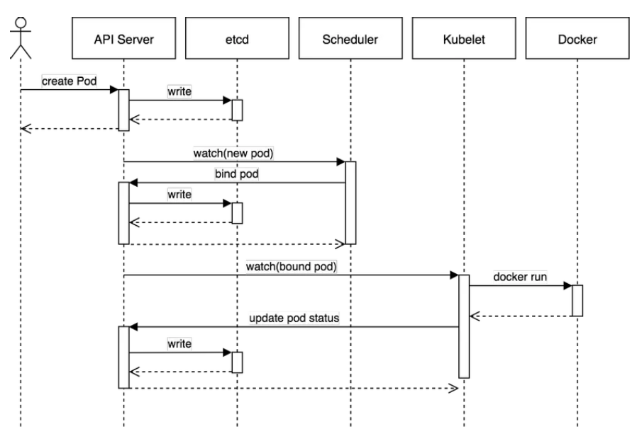
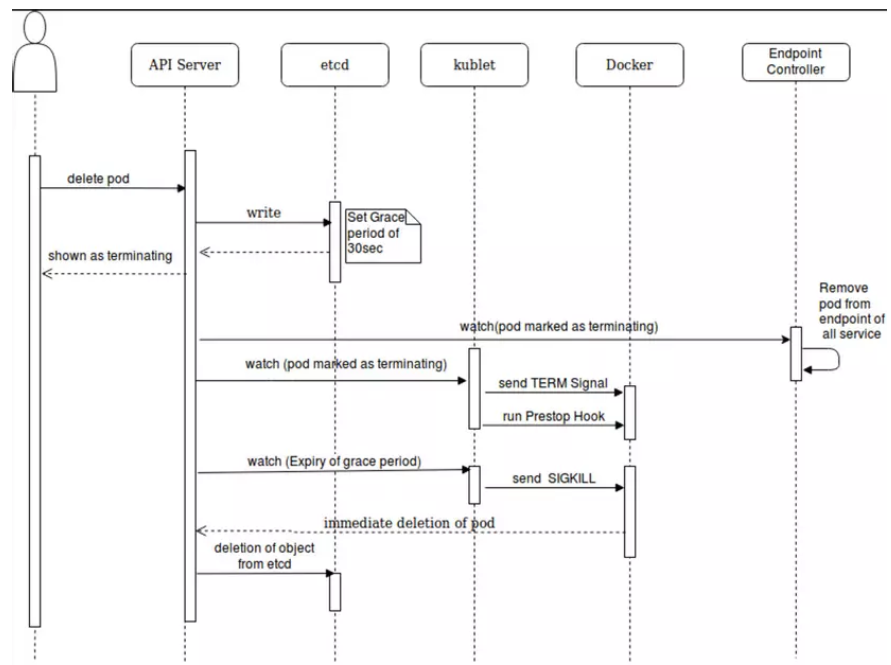

<h2>Pods</h2>

- Trong K8s, container là một gói nhẹ, độc lập, có thể thực thi được, bao gồm mọi thứ cần thiết để chạy một phần mềm, bao gồm mã, thời gian chạy, thư viện, biến môi trường và công cụ hệ thống. Container được cách ly với nhau và đóng gói phần mềm, thư viện cũng như tệp cấu hình của riêng chúng nhưng chúng chia sẻ nhân hệ điều hành với các vùng chứa khác. Chúng được thiết kế để có thể dễ dàng di chuyển trên các môi trường khác nhau, điều này khiến chúng trở nên lý tưởng để triển khai nhất quán trên các nền tảng khác nhau.

- Trong Kubernetes, container là đơn vị triển khai nhỏ nhất được lên lịch và quản lý. Chúng được gói gọn trong Pods , là đơn vị triển khai cơ bản trong cụm Kubernetes. Một Pod có thể chứa một hoặc nhiều container cần chạy cùng nhau trên cùng một máy chủ và chia sẻ cùng một mạng và tài nguyên lưu trữ, cho phép chúng giao tiếp với nhau bằng localhost.

- Pod đóng vai trò như một lớp trừu tượng, cho phép Kubernetes lên lịch và sắp xếp các container một cách hiệu quả. Khi quá trình triển khai yêu cầu nhiều vùng chứa hoạt động cùng nhau trên cùng một node, Pod sẽ được tạo để đảm bảo chúng được đặt cùng vị trí và có thể giao tiếp hiệu quả. Điều này giúp đơn giản hóa việc triển khai và quản lý các ứng dụng được đóng gói, giúp dễ dàng mở rộng quy mô, giám sát và cập nhật khi cần.

<h3>Pods as logical host</h3>

Một Pod có thể chạy một hoặc nhiều container có liên quan chặt chẽ với nhau, chia sẻ cùng bối cảnh mạng và lưu trữ. Bối cảnh được chia sẻ này rất giống với những gì bạn tìm thấy trên máy vật lý hoặc máy ảo, do đó có thuật ngữ "máy chủ logic". 

Những điểm chính cần hiểu về Pod với tư cách là máy chủ logic là:

- Các vùng chứa được liên kết chặt chẽ(Tightly coupled containers): Khi nhiều vùng chứa trong một Pod được coi là được liên kết chặt chẽ, điều đó có nghĩa là chúng có sự phụ thuộc lẫn nhau mạnh mẽ và cần liên lạc với nhau qua localhost. Điều này cho phép họ trao đổi dữ liệu và thông tin một cách hiệu quả mà không cần cấu hình mạng phức tạp.

- Không gian tên mạng dùng chung(Shared network namespace): Các vùng chứa trong cùng một Pod chia sẻ cùng một không gian tên mạng. Điều này ngụ ý rằng chúng có cùng địa chỉ IP và không gian cổng, giúp chúng giao tiếp dễ dàng hơn bằng cách sử dụng các cơ chế giao tiếp giữa các quá trình tiêu chuẩn.

- Bối cảnh lưu trữ được chia sẻ(Shared storage context): Các nhóm cũng chia sẻ cùng một bối cảnh lưu trữ, có nghĩa là chúng có thể truy cập cùng một khối lượng hoặc tài nguyên lưu trữ. Điều này tạo điều kiện thuận lợi cho việc chia sẻ dữ liệu giữa các vùng chứa trong Pod, tăng cường hơn nữa sự cộng tác của chúng.

- Đồng vị trí và đồng lập lịch(Co-location and co-scheduling): Kubernetes đảm bảo rằng tất cả các vùng chứa trong Pod đều được lên lịch và cùng đặt trên cùng một nút. Việc đồng lập kế hoạch này đảm bảo rằng các container có thể giao tiếp với nhau một cách hiệu quả trong cùng một bối cảnh mạng và lưu trữ.

- Bản chất phù du(Ephemeral nature): Giống như các vùng chứa riêng lẻ, các Pod được coi là phù du và có thể dễ dàng tạo, chấm dứt hoặc thay thế dựa trên yêu cầu mở rộng quy mô hoặc hạn chế về tài nguyên. Tuy nhiên, tất cả các thùng chứa trong Pod đều được coi là một đơn vị duy nhất về mặt lập kế hoạch và quản lý vòng đời.

# *.* Tạo Pod
Khi tạo một Pod mới, thì cơ bản các sự kiện diễn ra và các thành phần tham gia và các sự kiện đó như sau:
## 
### Chi tiết luồng tạo Pod:
- Khi ta thực hiện tạo một Pod mới, thông tường là dùng lệnh kubectl để apply một file yaml là file mô tả chi thiết các thông tin cần thiết cho việc tạo Pod. Khi đó bản chất lệnh kubectl sẽ làm việc với api-server để gọi một api tương ứng cho việc tạo Pod.

- API server xử lý yêu cầu trên bằng cách validate cú pháp của file yaml và nếu không có vấn đề gì thì sẽ thực hiện ghi dữ liệu này vào etcd - Là key-value db đã mô tả bên trên. Như vậy tại thời điểm này, trên hệ thống đã ghi nhận một Pod mới cần được tạo. Sau khi ghi xong vào etcd thì api-server phản hồi lại kết quả cho client là Pod đã được tạo.

- Lúc này tới lượt scheduler tham gia vào. Như đã nói, nó sẽ theo dõi các Pod mới tạo trên hệ thống (bằng cách định kỳ kiểm tra api-server xem có thay đổi không) mà chưa được gán vào node để xử lý. Giờ nó phát hiện ra Pod mới này, nó sẽ lấy thông tin của Pod này và tìm một node thỏa mãn các yêu cầu, ví dụ là node1 và update vào thông tin của Pod là nó hãy chạy trên node1. Thông tin này được scheduler gửi cho api-server

- API server nhận được thông tin Pod mới được gán vào node1 thì thực hiện update thông tin này và etcd. Lúc nào pod ở trạng thái bound.

- Tiếp đến là kubelet cũng theo dõi các Pod ở trạng thái bound và được xếp lịch chạy trên node đó (bằng cách định kỳ lấy thông tin từ api-server). Ví dụ trong trường hợp này kubelet trên node1 phát hiện Pod mới được yêu cầu chạy trên node1 nên nó sẽ lấy thông tin cần thiết cho Pod và chạy Pod này thành các container trên node1. sau đó update lại trạng thái của Pod cho api-server.

- API server nhận được thông tin cập nhật trạng thái Pod từ kubelet ở node1 thì nó thực hiện ghi thông tin này vào etcd và nhận phản hồi kết quả từ etcd. Sau đó nó gửi bản tin acknowledgement tới kubelete để báo rằng event này đã được chấp nhận.

# *.* Xóa Pod
Ngược lại với tạo Pod thì ta xem xét luồng xóa Pod như sau:
## 
### Chi tiết luồng xóa Pod:
Người dùng gửi lệnh để xóa Pod
Đối tượng Pod trên k8s được cập nhật trạng thái thành "dead" sau một khoảng thời gian gọi là grace-time
Các hành động sau diễn ra song song:
Pod sẽ hiện thị ở trạng thái "Terminating" khi được kiểm tra từ phía client
Kubelet thấy một Pod được đánh dấu là Terminating thì nó bắt đầu thực hiện dừng process của Pod
Endpoint controller theo dõi pod đã được xóa chưa để xóa thông tin pod đó khỏi các endpoint mà nó phục vụ
Nếu pod có định nghĩa một preStop hook, thì nó được gọi tới bên trong pod. Nếu preStop hook vẫn đang chạy mà grace-time đã hết, thì bước (2) sẽ lại được gọi với thời gian grace-time nới thêm là 2 giây. Các bạn có thể tìm hiểu thêm về "Container hook" ở đây.
Process bên trong Pod đã được gửi tín hiệu yêu cầu terminate (TERM signal)
Sau khi grace-time kết thúc, thì mọi process bên trong Pod sẽ bị kill bởi SIGKILL.
Kubelet hoàn thành xóa Pod bằng cách gọi API server và set grace-time bằng 0, nghĩa là yêu cầu xóa ngay lập tức. Lúc này Pod sẽ không còn và client sẽ không thể thấy được Pod này nữa.